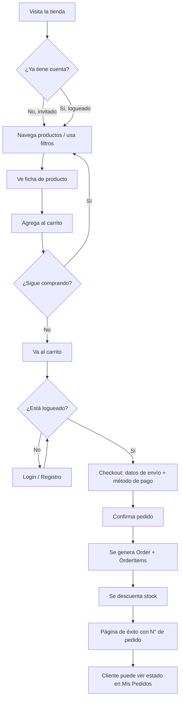
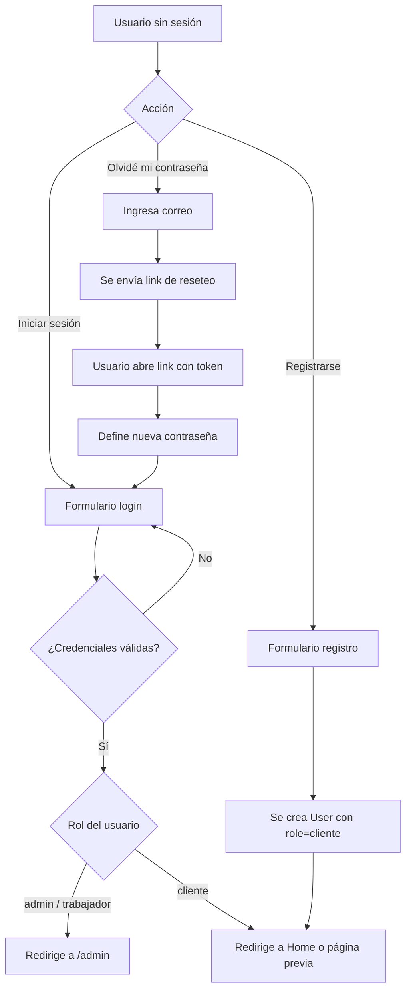
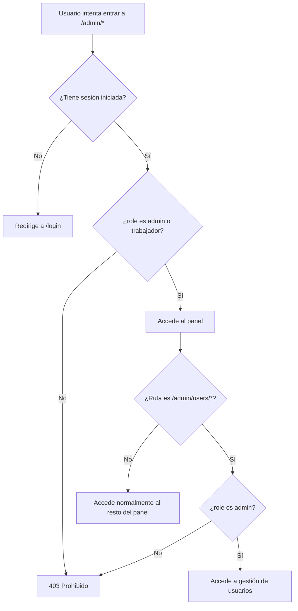
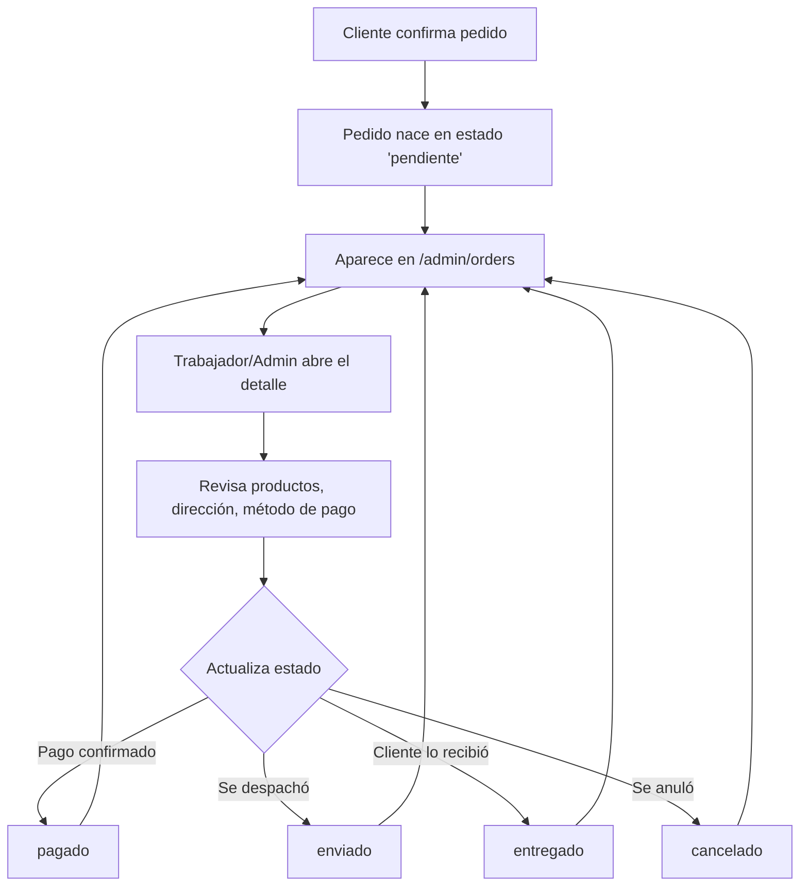
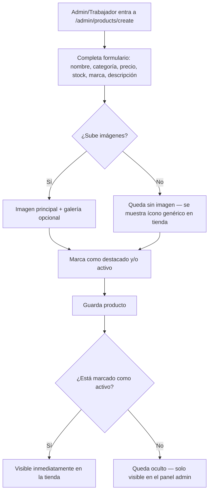
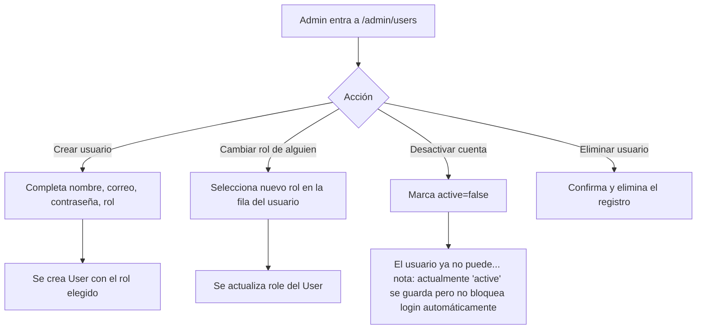
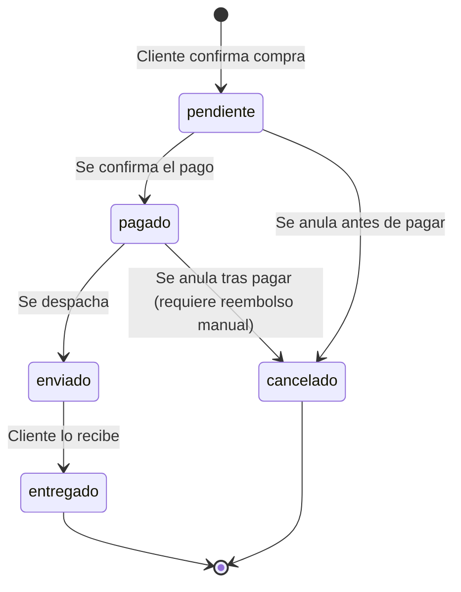
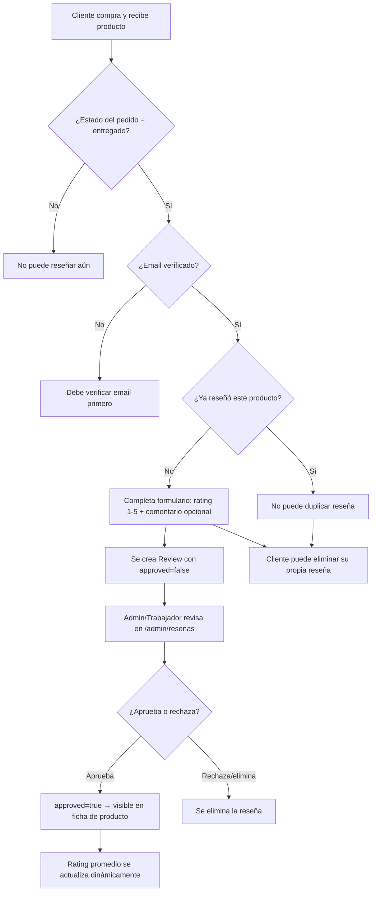

# Flujos del Sistema
## Negocios RaR — Plataforma de Tienda Virtual

**Versión:** 1.1
**Última actualización:** julio 2026

Todos los diagramas están en sintaxis Mermaid — se pueden pegar en cualquier visor compatible (GitHub, Mermaid Live Editor, Notion, etc.) para renderizarlos.

---

## 1. Flujo de compra (cliente, de principio a fin)



**Reglas de negocio embebidas en este flujo:**
- El carrito es accesible sin cuenta (vía `session_id`).
- El checkout **exige** sesión iniciada (middleware `auth`).
- Al confirmar el pedido: se crea `Order`, se copian los ítems del carrito a `OrderItem` (snapshot de nombre/precio), se descuenta `stock` de cada `Product`, y se vacía el carrito.
- Envío gratis si el subtotal ≥ S/ 200 (regla actualmente hardcodeada en `CheckoutController`).

---

## 2. Flujo de autenticación



---

## 3. Flujo de control de acceso al panel administrativo



---

## 4. Flujo del chat de soporte (Contáctanos)

```mermaid
flowchart TD
    A[Cliente entra a Contáctanos] --> B{¿Está logueado?}
    B -->|No| C[Pantalla: "Inicia sesión para chatear"]
    C --> D[Botones: Iniciar sesión / Registrarme]
    B -->|Sí| E{¿Tiene conversación abierta?}
    E -->|No| F[Se crea Conversation nueva]
    E -->|Sí| G[Se carga Conversation existente]
    F --> H[Cliente escribe mensaje]
    G --> H
    H --> I[Se guarda Message con is_staff=false]
    I --> J[Aparece en bandeja del panel admin]
    J --> K[Trabajador/Admin responde desde /admin/messages]
    K --> L[Se guarda Message con is_staff=true]
    L --> M[Cliente ve la respuesta al recargar el chat]
```

**Nota técnica:** el chat actual es de tipo *pull* (se ve la respuesta al recargar/volver a entrar), no tiene actualización en tiempo real (WebSockets/polling). Ver documento de contexto para IA — sección de mejoras esperadas.

---

## 5. Flujo de gestión de un pedido (lado administrativo)



**Nota:** el cambio de estado es manual y no dispara automáticamente ninguna notificación al cliente en el MVP actual (deuda técnica conocida).

---

## 6. Flujo de publicación de un producto nuevo



---

## 7. Flujo de gestión de usuarios y roles (solo Admin)



**⚠️ Nota importante para desarrollo futuro:** el campo `active` en `users` existe en el modelo de datos, pero el flujo de login **no verifica actualmente** que el usuario esté activo antes de dar acceso. Esto está documentado como pendiente en el documento de contexto para IA (sección "Brechas conocidas").

---

## 8. Mapa general de estados de un pedido



---

## 9. Flujo de reseñas y calificaciones



**Reglas de negocio:**
- Solo clientes con email verificado pueden reseñar.
- Deben haber comprado el producto Y el pedido debe estar en estado `entregado`.
- Un cliente solo puede escribir una reseña por producto (unique product_id + user_id).
- La reseña nace con `approved=false` y debe ser aprobada por un admin/trabajador.
- Las calificaciones mostradas en la tienda (ficha de producto y tarjetas) usan el promedio de reseñas aprobadas.

---

## 10. Flujo de lista de deseos (wishlist)

```mermaid
flowchart TD
    A[Cliente navega productos] --> B[Ve tarjeta o ficha de producto]
    B --> C{¿Hace clic en corazón?}
    C -->|No| D[Sigue navegando normalmente]
    C -->|Sí| E{¿Está logueado?}
    E -->|No| F[Redirige a /login — middleware auth]
    F --> G[Inicia sesión o se registra]
    G --> E
    E -->|Sí| H[WishlistController@toggle]
    H --> I{¿Producto ya está en wishlist?}
    I -->|No| J[Crea registro en wishlists → mensaje: "Agregado a tu lista de deseos"]
    I -->|Sí| K[Elimina registro de wishlists → mensaje: "Eliminado de tu lista de deseos"]
    J --> L[Redirige a página anterior con toast success]
    K --> L

    M[Cliente entra a /mi-lista-de-deseos] --> N[Lista de productos guardados]
    N --> O{Por cada producto}
    O -->|Botón Quitar| P[Elimina ítem de wishlist]
    O -->|Botón Agregar al carrito| Q[Redirige a carrito]
    O -->|Click en tarjeta| R[Va a ficha de producto]
```

**Reglas de negocio:**
- La wishlist solo está disponible para usuarios autenticados (middleware `auth`).
- Un producto no puede estar dos veces en la wishlist del mismo usuario (índice único `user_id + product_id`).
- El toggle (agregar/quitar) funciona desde cualquier página (ficha, listado, tarjeta) redirigiendo siempre a la página anterior con `back()`.
- El ícono corazón se muestra lleno o vacío según el estado (`auth()->user()->hasInWishlist($product)`).
- La wishlist es una señal de intención de compra: desde el panel admin se puede ver qué productos son los más deseados (top 5), útil para remarketing.
- El badge del navbar muestra la cantidad total de productos guardados y se actualiza con cada cambio (vía View Composer global que comparte `$wishlistCount`).

---

## 11. Flujo de aplicación de cupón

```mermaid
flowchart TD
    A[Cliente en checkout] --> B[Ingresa código de cupón]
    B --> C[Pulsa "Aplicar"]
    C --> D[Fetch POST /checkout/aplicar-cupon]
    D --> E{Servidor valida}
    E -->|Cupón no existe| F[Mensaje: "El cupón ingresado no existe"]
    E -->|No vigente / agotado| G[Mensaje específico: expirado / límite alcanzado / etc.]
    E -->|No cumple compra mínima| H[Mensaje: monto mínimo requerido]
    E -->|Válido| I[Guarda coupon_id en sesión]
    I --> J[Responde JSON con descuento + nuevo total]
    J --> K[Frontend actualiza resumen: línea de descuento verde, total recalculado]
    K --> L[Cliente confirma pedido]
    L --> M[CheckoutController@store revalida coupon]
    M --> N{¿Sigue siendo válido?}
    N -->|No| O[Ignora cupón, continúa sin descuento, avisa al cliente]
    N -->|Sí| P[Calcula descuento real en servidor]
    P --> Q[DB transaction: crea Order con coupon_id/code/discount_amount]
    Q --> R[Crea CouponUse con discount_amount real]
    R --> S[Incrementa coupon.usage_count en 1]
    S --> T[Limpia applied_coupon de sesión]
    T --> U[Redirige a éxito con mensaje de descuento aplicado]
    O --> U
    F --> B
    G --> B
    H --> B
```

**Reglas de negocio:**
- El descuento se calcula **siempre** en el servidor, nunca se recibe del frontend.
- Doble validación: al aplicar el cupón (AJAX) y al confirmar el pedido (server-side en `CheckoutController@store`).
- Si el cupón deja de ser válido entre la aplicación y la confirmación (ej. alguien más agotó el límite), la compra sigue sin descuento y se avisa al cliente.
- El registro de uso (`CouponUse`) y el incremento de `usage_count` ocurren dentro de la misma transacción que crea el `Order`.
- Si el cupón tiene `category_id`, el descuento solo se calcula sobre los productos de esa categoría en el carrito, no sobre el subtotal completo.
